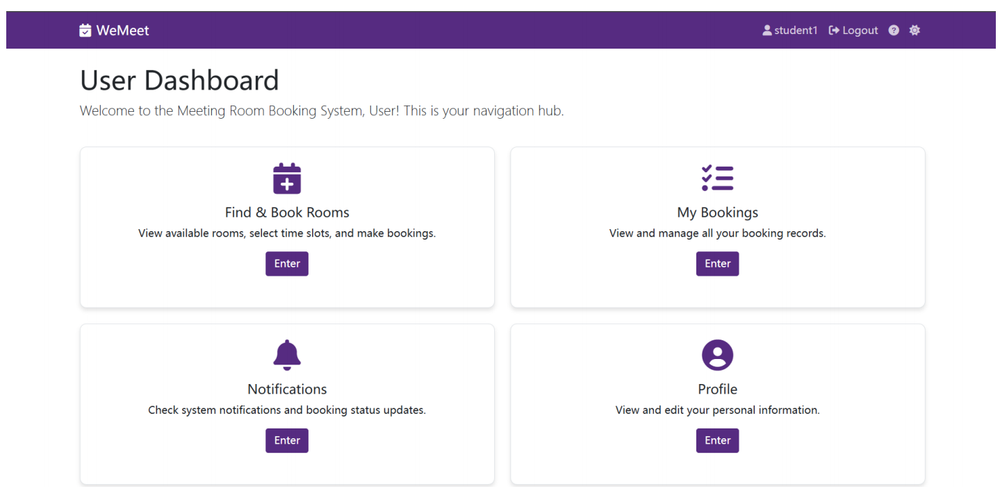

# WeMeet: Online Meeting Room Booking System


**WeMeet** is a secure, scalable, and user-centric web application designed for managing and booking meeting rooms in academic environments. Developed as part of the CPT202 Software Engineering Group Project, this system addresses the limitations of existing booking platforms by offering advanced features, robust security, and a modern, intuitive user interface.

The project was developed following the **Scrum agile methodology**, with development organized into two-week sprints to ensure iterative progress, adaptability to changing requirements, and consistent delivery of high-quality features.

### Demo



---

## Key Features

The system provides a comprehensive set of features tailored for both regular users and administrators, with a strong focus on security and usability.

### General Features
*   **Role-Based Access Control (RBAC)**: Clear distinction between `User` and `Admin` roles, with granular permissions for each.
*   **Secure Authentication & Session Management**: Implements JWT (JSON Web Token) based stateless authentication, managed with Redis for enhanced security and scalability.
*   **Responsive User Interface**: Frontend built with Thymeleaf, Bootstrap, and AJAX to deliver a dynamic and responsive user experience without full page reloads.
*   **Email Notifications**: Integrated with Spring Mail for user registration verification, password resets, and booking confirmations.

### User Features
*   **User Registration & Profile Management**: Secure registration with email verification, password strength validation, and the ability to upload custom avatars.
*   **Advanced Room Search & Filtering**: Users can easily find meeting rooms by filtering based on capacity, location, floor, and available IT facilities (projector, screen, etc.).
*   **Booking Management**: Create, view, update, and cancel reservations through an intuitive interface.

### Administrator Features
*   **Full Room Catalog Management**: Administrators can add, edit, and delete meeting rooms, including details like images, capacity, and equipment.
*   **Comprehensive Booking Oversight**: Review and manage all user bookings, with the ability to approve or reject requests.
*   **User Account Control**: Manage all user accounts, including the ability to lock or unlock accounts based on activity or violations.
*   **Monitoring & Analytics**: Access to dashboards and logs for real-time monitoring of system usage, booking trends, and user activities.

---

## Technology Stack

WeMeet is built on a modern, robust, and scalable technology stack suitable for enterprise-level web applications.

| Category             | Technology / Tool                                     |
| -------------------- | ------------------------------------------------------- |
| **Programming Language** | Java 17                                               |
| **Backend Framework**  | Spring Boot, Spring Security, Spring Data JPA         |
| **Frontend**           | Thymeleaf, HTML5, CSS3, JavaScript, Bootstrap 5         |
| **Database**           | MySQL (hosted on Alibaba Cloud RDS)                     |
| **Caching**            | Redis (for session tokens, CAPTCHA, and hot data)       |
| **Authentication**     | JWT (JSON Web Tokens)                                   |
| **File Storage**       | Alibaba Cloud OSS (for user avatars)                    |
| **Build & Dependencies** | Maven                                                   |
| **Deployment**         | Docker, Docker Compose, Alibaba Cloud (ECS, SLB)      |
| **API Testing**        | Postman                                                 |
| **Unit Testing**       | JUnit 5, Mockito                                        |

---

## System Architecture

The application is designed using industry-standard architectural patterns to ensure maintainability, scalability, and a clear separation of concerns.

*   **Layered Architecture**: The system is divided into distinct layers:
    *   **Presentation Layer**: Handles all user interaction (UI) and HTTP requests/responses.
    *   **Business Logic Layer**: Contains the core application logic and services.
    *   **Persistence Layer**: Manages all data access and communication with the database.
    *   **Domain Layer**: Defines the core entities of the system (e.g., `User`, `Booking`).

*   **Model-View-Controller (MVC) Pattern**: Within the Presentation Layer, the MVC pattern is used to separate the data (Model), the user interface (View), and the control logic (Controller).

*   **Browser/Server (B/S) Architecture**: Users access the system via a web browser, communicating with the backend through asynchronous AJAX requests, which provides a smooth and interactive experience.

---

## Security Features

Security was a primary consideration throughout the development process.

*   **Password Encryption**: All user passwords are encrypted using the **BCrypt** hashing algorithm before being stored in the database.
*   **CAPTCHA Verification**: A graphical CAPTCHA is implemented on the login page to prevent automated brute-force attacks.
*   **Stateless JWT Authentication**: Protects all sensitive endpoints and ensures that only authenticated and authorized users can access specific resources.
*   **Account Lockout Policy**: User accounts are temporarily locked after multiple failed login attempts to deter malicious actors.

---

## Getting Started

The project is containerized using Docker, which is the recommended way to run the application locally.

### Prerequisites
*   Java Development Kit (JDK) 17 or later
*   Apache Maven 3.6+
*   Docker and Docker Compose

### Running with Docker (Recommended)

The `WeMeet.zip` file contains the complete source code, including a `docker-compose.yml` file for easy setup.

1.  **Unzip the Project**:
    Extract the `WeMeet.zip` file to a location on your machine.

2.  **Build and Run with Docker Compose**:
    Navigate to the root directory of the extracted project in your terminal and run:
    ```bash
    docker-compose up --build
    ```
    This command will build the Docker images for the Spring Boot application, MySQL database, and Redis cache, and then start all the services.

3.  **Access the Application**:
    Once all containers are running, you can access the WeMeet application by navigating to `http://localhost:8080` in your web browser.
